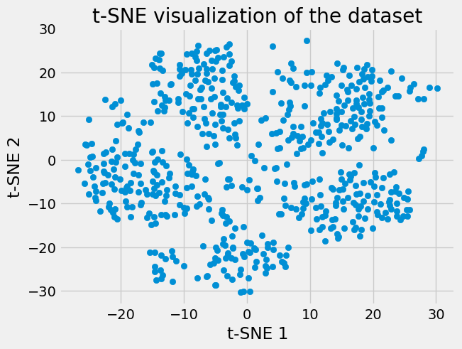
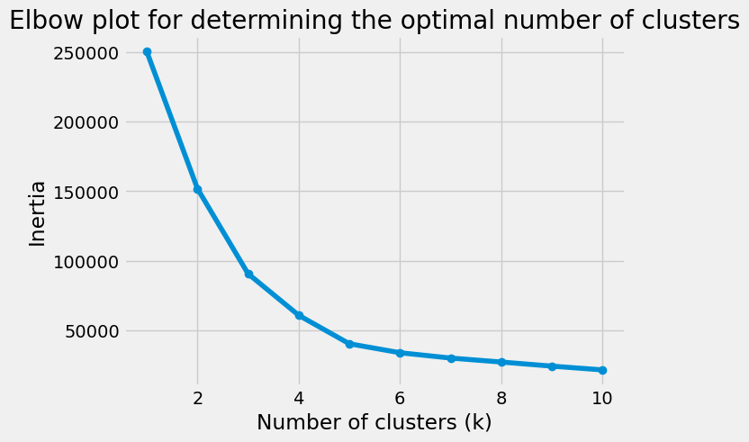
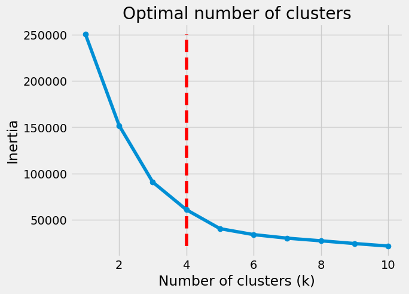

<p align="center">

</p>

# Module 20 Challenge Submission - Unsupervised Machine Learning

#### This repository contains the code and resources for analyzing the Myopia dataset. The goal of this project is to identify the optimal number of clusters for the Myopia dataset using principal component analysis (PCA) and t-distributed stochastic neighbor embedding (t-SNE).


## Table of Contents
- [Getting Started](#getting-started)
- [Project Deliverables](#project-deliverables)
- [Conclusion](#conclusion)
- [Project Structure](#project-structure)
- [Contributing](#contributing)
- [Acknowledgments](#acknowledgments)
- [References](#references)

## Getting Started

Getting Started
To get started with this project, you will need to have Python 3 and several libraries installed, including Pandas, Matplotlib, Scikit-learn, and kneed. You can install these libraries using pip or conda. Once you have the necessary libraries, you can retrieve the Myopia dataset, which is located in the Resources folder. The main code for the project is in the main.ipynb Jupyter Notebook, which contains the steps for data preparation, PCA, t-SNE, and KMeans clustering. You can run the code cells in the notebook to replicate the analysis and generate the results. We recommend using an Anaconda environment to manage the dependencies and ensure reproducibility.

## Project Deliverables

#### Part 1: Data Preparation
The first part of the analysis involves data preparation, where we read the Myopia dataset, drop the MYOPIC column, and standardize the data using the StandardScaler function. The resulting scaled data is converted back to a Pandas DataFrame with the original column names.



#### Part 2: Dimensionality Reduction and Clustering
The second part of the analysis involves dimensionality reduction using PCA and t-SNE and clustering using KMeans. We use PCA to reduce the number of features to those that explain 90% of the variance. We then use t-SNE to project the principal components into two-dimensional space, allowing us to visualize the clusters. We then apply KMeans clustering to the t-SNE output and use the elbow method and the kneed library to determine the optimal number of clusters.



## Conclusion
The findings suggest that the patients in the Myopia dataset can be clustered into 4 distinct groups based on their features. This provides valuable insight into the characteristics of the patients and could potentially inform treatment decisions or further research. The use of the elbow plot and the kneed library helps to provide a more objective measure of the optimal number of clusters and improves the reliability of the analysis.



## Project Structure

```
README.md
index.html
Credit Risk Evaluator.ipynb
requirements.txt
images
   |-- Unsupervised-learning.jpg
   |-- Clustering.png
   |-- Elbow.png
   |-- Optimal.png
Resources
   |-- myopia.csv

```
## Contributing

Pull requests are welcome. For major changes, please open an issue first to discuss what you would like to change.

## Acknowledgments
I would like to thank our bootcamp instructors for their guidance and support throughout this assignment.

## References
-	Pandas: https://pandas.pydata.org/
-	scikit-learn: https://scikit-learn.org/stable/
-	Jupyter Notebook: https://jupyter.org/
-	University of Western Australia Data Bootcamp: https://bootcamp.ce.uwa.edu.au/data/
